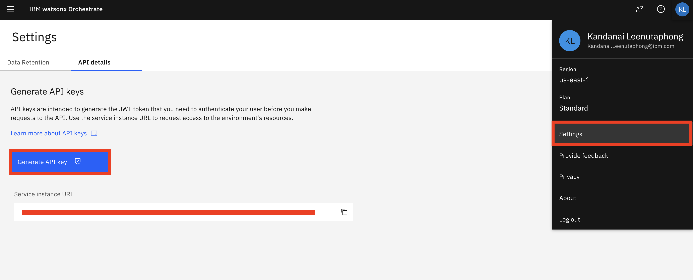

### Installing Python 3.11

Before proceeding, ensure you have Python 3.11 installed on your system.

#### On Ubuntu/Linux:
```
sudo apt update
sudo apt install python3.11 python3.11-venv python3.11-distutils
```

#### On Windows:
1. Download the Python 3.11 installer from the [official Python website](https://www.python.org/downloads/release/python-3110/).
2. Run the installer and follow the prompts. Make sure to check "Add Python to PATH" during installation.

#### Verify installation:
```
python3.11 --version
```
You should see output similar to: `Python 3.11.x`

---

### Registering and provisioning watsonx Orchestrate Free Trial

1. Please access the following link:
https://www.ibm.com/products/watsonx-orchestrate and click on `Try it for free`


2. please fill in your email address can be personal email address and other information to register for watsonx Orchestrate


3. After registering you should get a code to your email.


4. Please add the code to register for free trial


5. Once registered please deploy the trial in `us-east` region


6. You will be directed to: https://dl.watson-orchestrate.ibm.com/. Afterwards please, login with the IBMid and password you signed up with.


7. Your instance have been successfully provisioned once you landed here.


### Installation of dependencies
Install and create a virtual environment from `requirement.txt`. Ensure your python version is 3.11

Run the following command

```
python3.11 -m venv venv
source venv/bin/activate
pip install -r requirement.txt
```

### Activating watsonx Orchestrate environment
Assuming your are running watsonx Orchestrate on AWS Cloud (Saas),
Please get your credentials from 
```
orchestrate env list
orchestrate env add -n trial-env -u <Service instance URL>
orchestrate env activate trial-env
(Then enter API Key)
```
https://developer.watson-orchestrate.ibm.com/environment/production_import