# Watson Orchestrate - Tavily MCP Integration

This guide walks you through integrating Tavily search capabilities with Watson Orchestrate using Model Context Protocol (MCP).

## Prerequisites

- Python 3.11 or higher
- IBM Watson Orchestrate account
- Tavily API account

## Setup Instructions

### 1. Navigate to the Project Directory

First, navigate to the MCP Tavily directory:

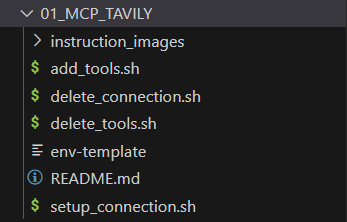

```bash
cd 01_MCP_TAVILY
```

### 2. Create Python Virtual Environment

Create and activate a virtual environment using Python 3.11:

```bash
python3.11 -m venv .venv
source .venv/bin/activate
```

### 3. Install Required Dependencies

Install the Watson Orchestrate library:

```bash
pip install ibm-watsonx-orchestrate
```

To verify the installation, run the `orchestrate` command. You should see the Watson Orchestrate ADK help menu.

### 4. Configure Environment Variables

Copy the environment template and create your `.env` file:

```bash
cp env-template .env
```

The `.env` file should contain:
```
TAVILY_API_KEY=
```


### 5. Get Tavily API Key

1. Visit the [Tavily website](https://www.tavily.com/)
2. Sign up or log in to your account


3. Copy your API key and add it to your `.env` file

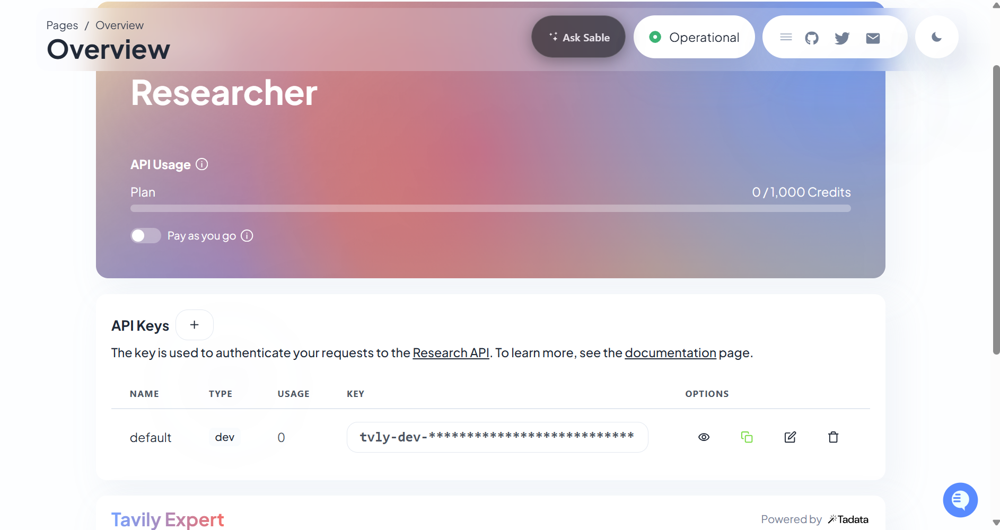

### 6. Get Watson Orchestrate API Credentials

1. Go to [Watson Orchestrate Developer Portal](https://dl.watson-orchestrate.ibm.com/)
2. Open Settings

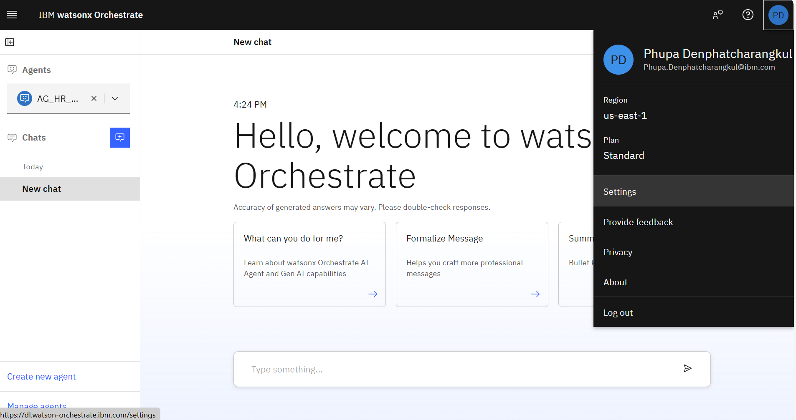

3. Navigate to API Details

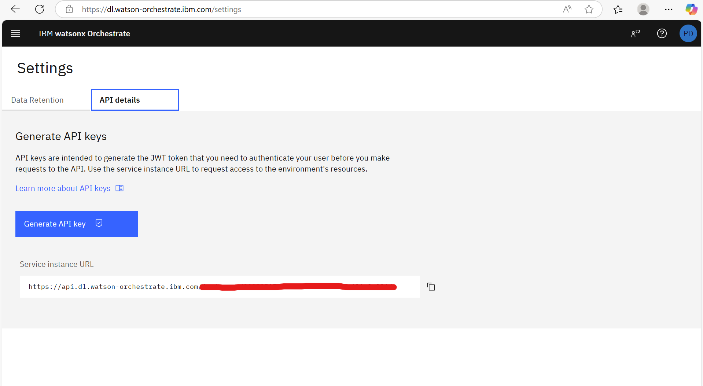

4. Save your URL and API Key:
   - **URL**: `https://api.us-south.watson-orchestrate.cloud.ibm.com/xxxxxxxxxxxxxxxxxxxx`
   - **API Key**: `XXXXXXXXXXXXXXXXXXXXXXXXXXXXX`

### 7. Add Watson Orchestrate Environment

Add a new environment using your saved URL:

```bash
orchestrate env add -n <env_name> -u <YOUR_URL>
```

Replace `<env_name>` with your preferred environment name and `<YOUR_URL>` with the URL from step 6.

### 8. Activate Environment

Activate your environment and provide your API key when prompted:

```bash
orchestrate env activate <env_name>
```

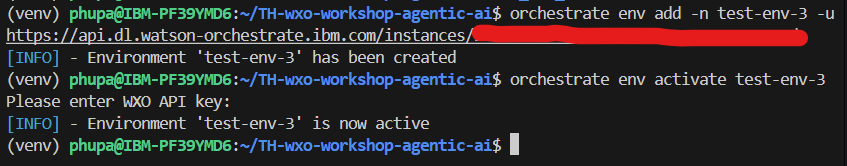

### 9. Setup Connection

Run the connection setup script:

```bash
chmod +x setup_connection.sh
./setup_connection.sh
```

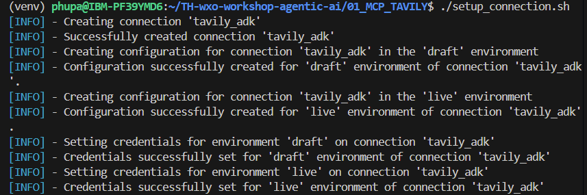

### 10. Import Tavily Tools

Run the tools import script:

```bash
chmod +x add_tools.sh
./add_tools.sh
```


### 11. Verify MCP Services

You can now find the imported tools in the MCP services section of Watson Orchestrate.

## Creating Your AI Agent

### 12. Create New Agent

In your Watson Orchestrate instance, create a new agent:

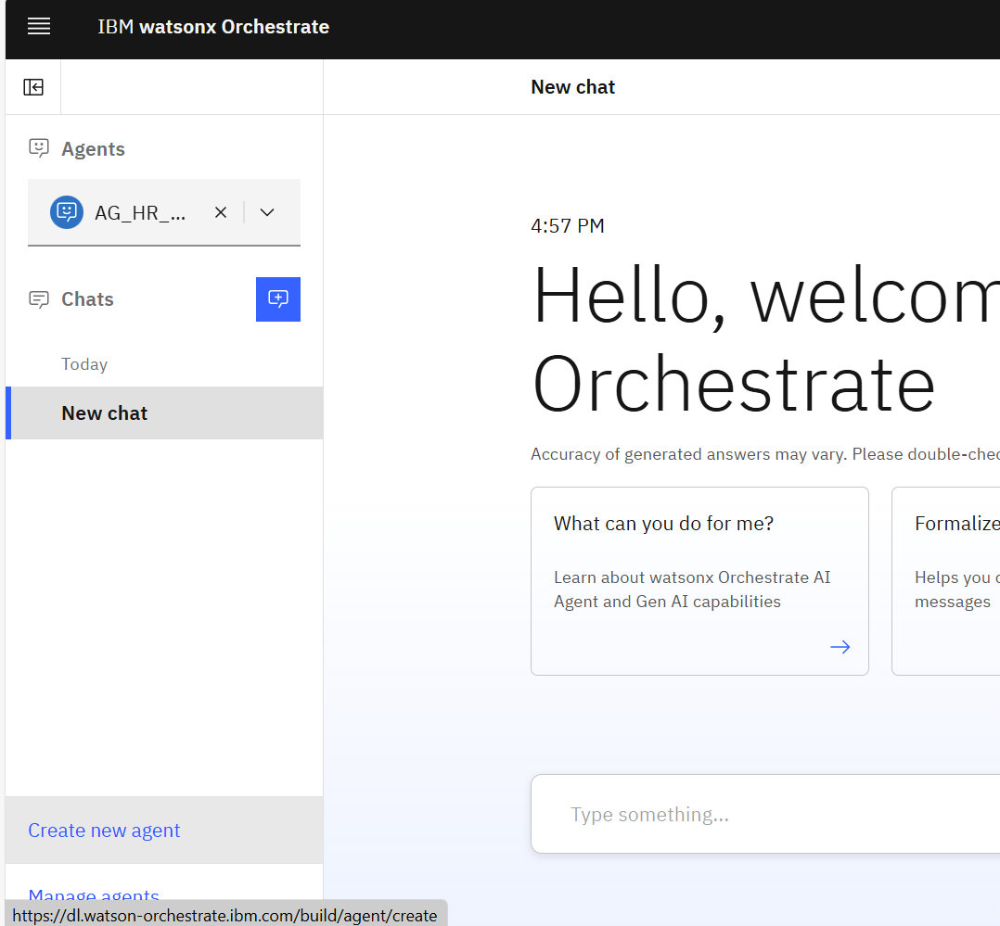
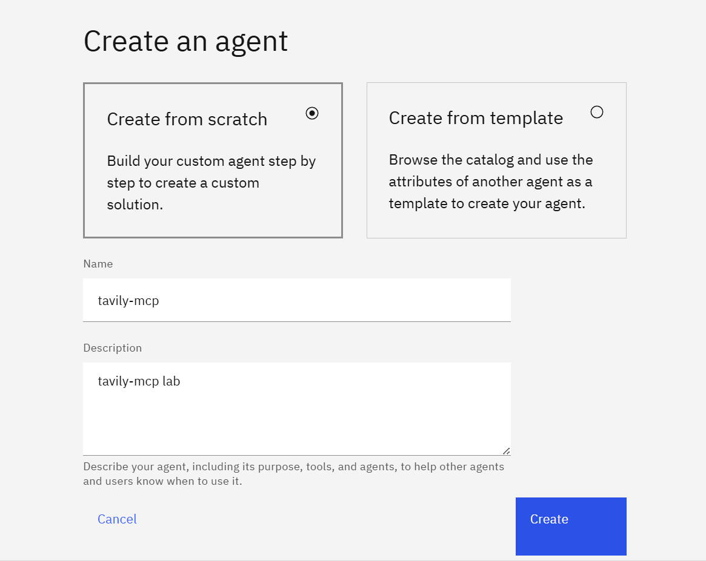

### 13. Import External Tools

Navigate to the tools section and import external tools:


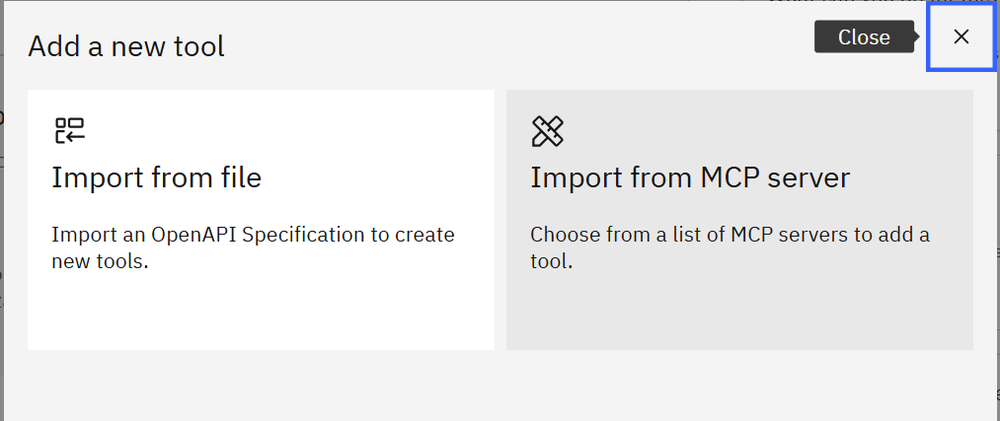

### 14. Connect MCP Server

1. Go to "Manage MCP Server"
2. Find `mcp-travily-adk` (added in step 10)
3. Open details and click "Connect"

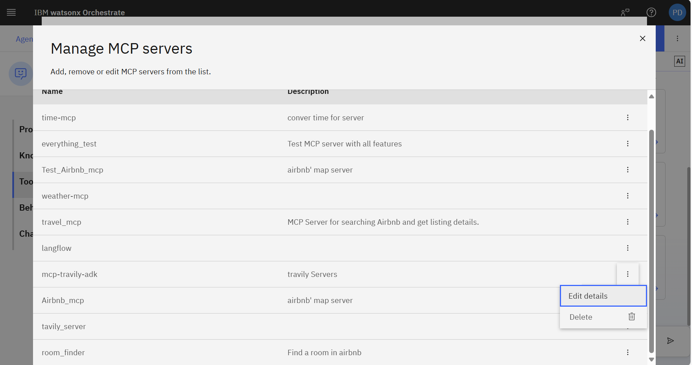

### 15. Activate Tavily Tools

Return to the import overlay and activate all Tavily tools:

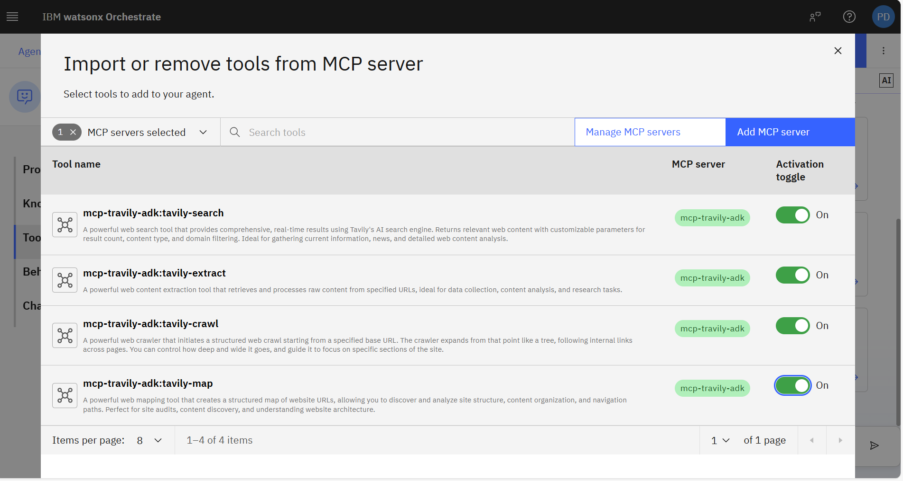

### 16. Configure Model

Select the recommended model:
- **Model**: `llama-3-405b-instruct`

### 17. Set Agent Behavior

Add the following instructions to your agent's behavior settings:

```
Ensure "Query" passed to tavily_server:tavily-search tool is English only.

Be as helpful as possible and respond in markdown format to user's query. Whenever appropriate, respond as lists. Respond in the same language as user's query (Thai)
```

### 18. Test Your Agent

Test the agent with a sample question in Thai:

**Example**: "มีราเมงอะไรบ้างในกรุงเทพ" (What ramen restaurants are there in Bangkok?)

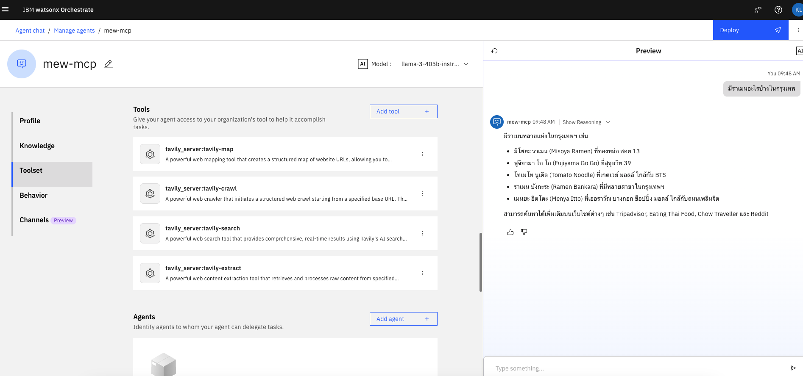

## Troubleshooting

### Common Issues

1. **Line ending errors**: If you encounter line ending issues, change the line ending to LF (Unix) 

2. **Permission denied**: Make sure scripts are executable:
   ```bash
   chmod +x *.sh
   ```

3. **Missing .env file**: Ensure you've copied the template and added your API key:
   ```bash
   cp env-template .env
   # Edit .env to add your TAVILY_API_KEY
   ```
