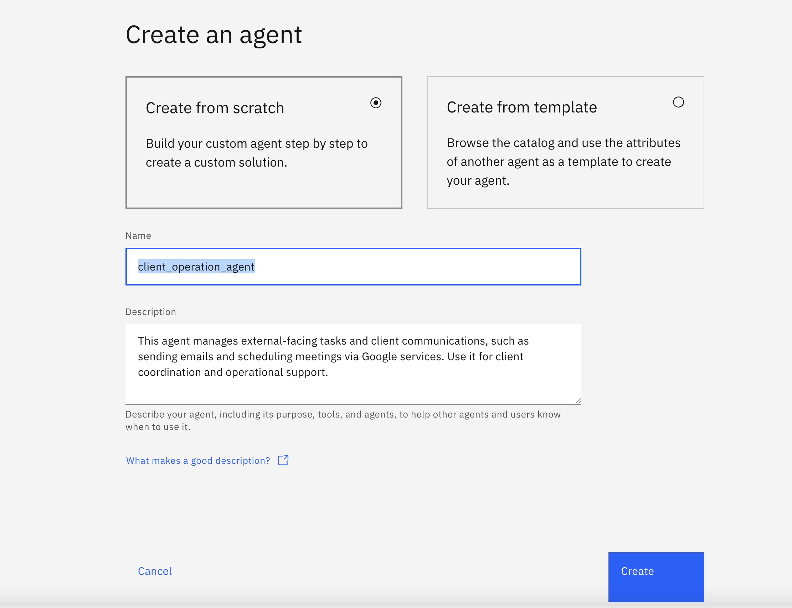
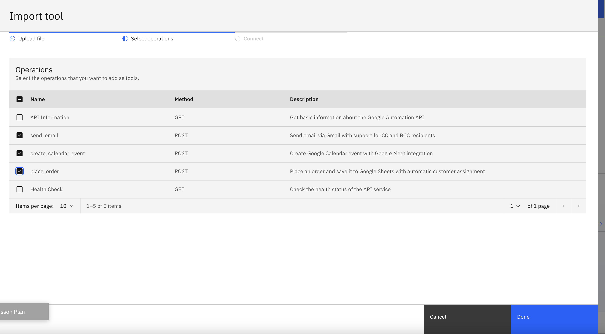
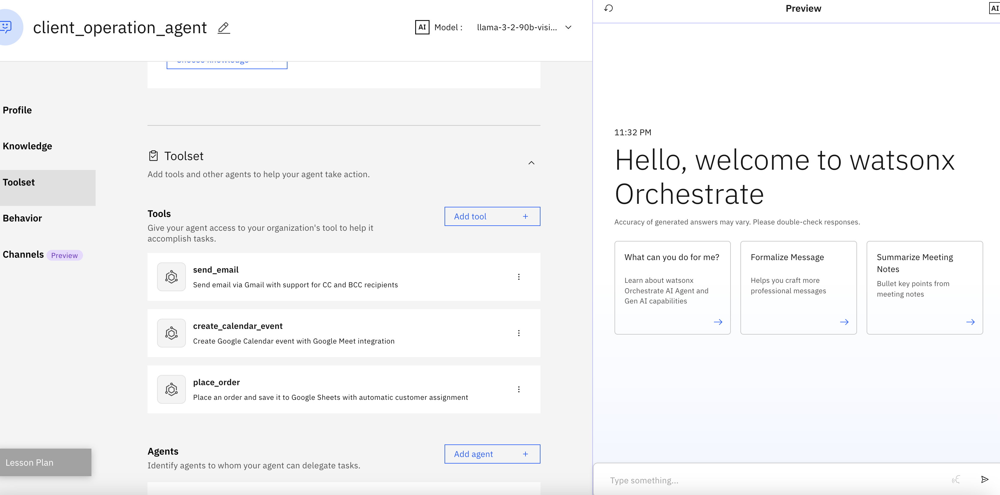
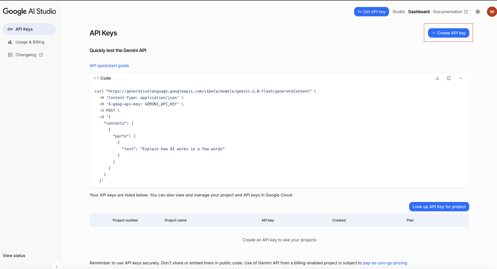
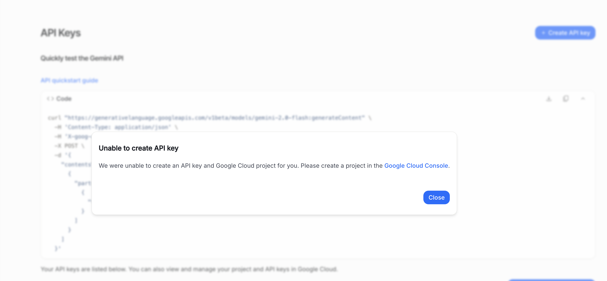
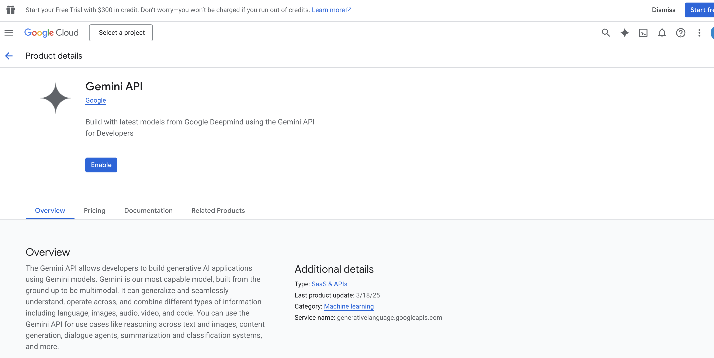
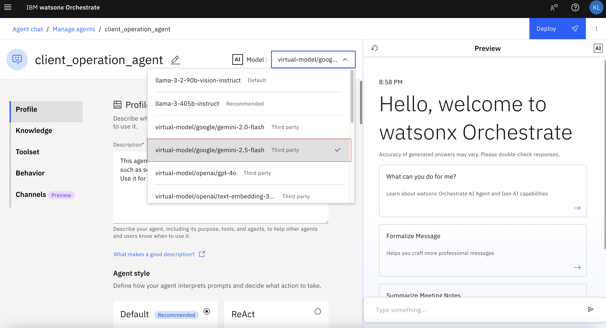

## Instructions

1. Please create an agent called `client_operation_agent`

2. upload the openapi json file that is provided called `openapi_tools/automation_openapi.json` and add google calendar and send gmail tools.

You should see that the tools have been added.

3. Please choose `meta-llama/llama-3-405b-instruct` and test the agent with following queries:

**Testing Queries**

- สวัสดีครับช่วยส่งอีเมลหา `replace_with_your_email` มีหัวข้อเกี่ยวกับ "self introduction" และเนื้อหาคือ "Hello how are you"
- ช่วยยิงนัดกับ `replace_with_your_email` หน่อยวันที่ 11 ธันวาคม 2025, 11:00-12:00 ว่า "Self Introduction"
- ช่วยสั่งสินค้า 'ABC' จำนวน 1 ชิ้น

To improve the model performance in Thai even further, watsonx Orchestrate supports using external models through feature called `AI gateway`. Read more later at: https://developer.watson-orchestrate.ibm.com/llm/managing_llm

4. Our goal is to add `google/gemini-2.5-flash` to watsonx Orchestrate. Rename `env-template` to `.env` and add in your `GOOGLE_API_KEY`.Please visit https://aistudio.google.com and click generate an API key to get your API key.

NOTE:
If you are unable to create api key, it means you haven't enabled Gemini API in Google cloud console and created a project. Hence please, enable gemini API and create a project.

Enabling Gemini API

Creating Project

5. Ensure you have completed the instructions in `00_SETUP`. Now that you have all credentials, please run `set_connections.sh` followed by `add_models.sh` in `AI_gateway/` folder. You should see the model being added.

