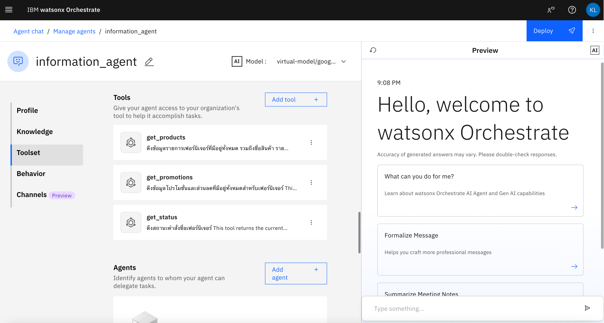
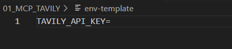
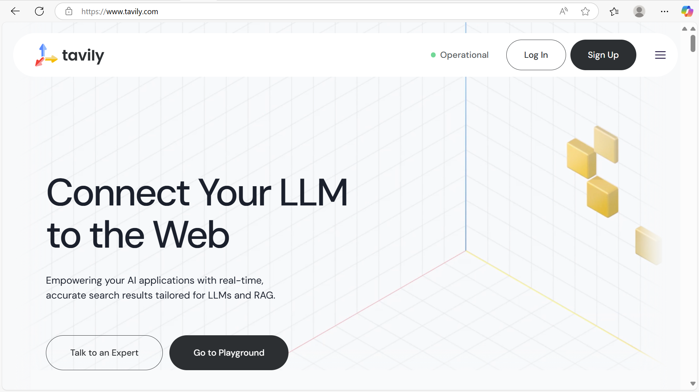
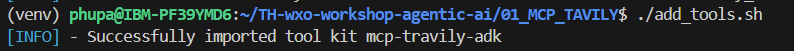
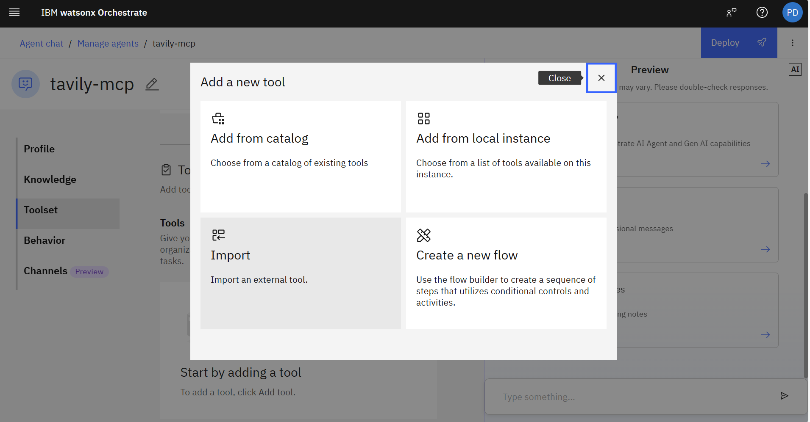
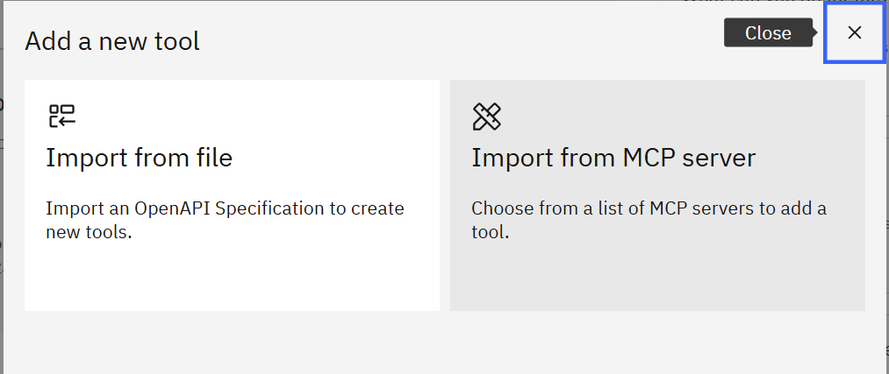
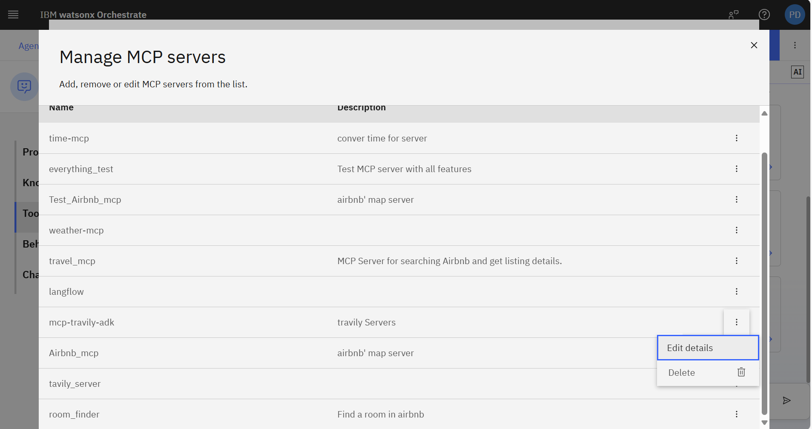
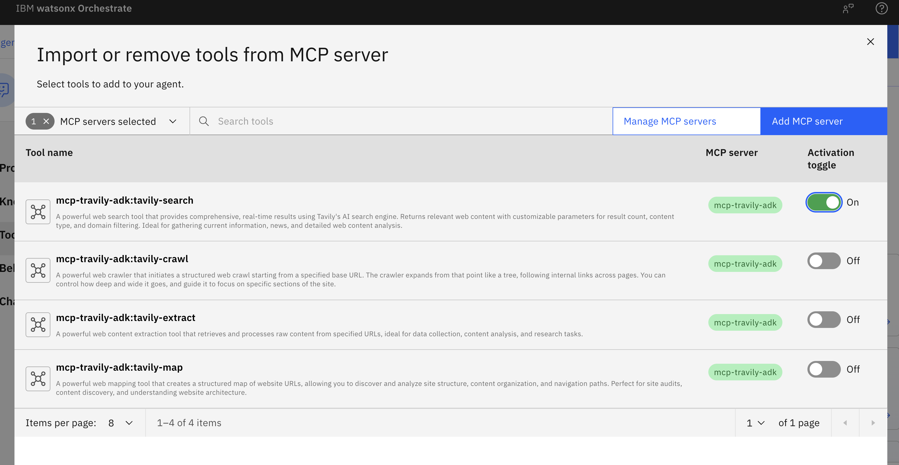

# Instructions


### 1. Adding agents and python tools  via. watsonx Orchestrate adk
We will now create an agent called information_agent that will handle all queries related to information retrieval. To create an agent please run 
`bash import_all.sh`


An agent like above will be created from the `.yaml` file and python tools in `tools/` folder

### 2. Testing the initial agent
Please test the `information_agent` using the **example queries** below:  


a. **Test get_products**: 
ร้านนี้มีเก้าอี้สีแดงขายบ้างไหม
b. **Test get_promotions**: 
มี voucher อะไรที่ใช้ลดราคาสินค้านี้ได้บ้าง
c. **Test get_status**: 
ที่เคยสั่งเก้าอี้สีแดงไว้ ตอนนนี้อยู่ที่ไหนแล้ว

### 3. Adding Tavily MCP server

Aside from adding python tools, openapi specification, watsonx Orchestrate also supports adding MCP servers via. both the UI and adk.

1. Copy the environment template and create your `.env` file:

```bash
cp env-template .env
```

The `.env` file should contain:
```
TAVILY_API_KEY=
```



2. Get Tavily API Key

a. Visit the [Tavily website](https://www.tavily.com/)
b. Sign up or log in to your account



c. Copy your API key and add it to your `.env` file


3. Setup Connection

Please locate the `mcp-server/` folder and run

```bash
bash setup_connection.sh
```


After, the connection has been added we will add the the tavily mcp-server.

```bash
bash add_tools.sh
```




You can now find the imported tools in the MCP services section of Watson Orchestrate.

Navigate to the tools section and import external tools:




a. Go to "Manage MCP Server"
b. Find `mcp-travily-adk` that has been added
c. Open details and click "Connect"




Return to the import overlay and activate only the `mcp-travily-adk:tavily-search` tool.



Now you can test the tool with:
**web_search**: 
ลองค้นหาหน่อยว่าต้องใช้เวลานานแค่ไหนในการส่งสินค้าทางรถจากนครศรีธรรมราชมากรุงเทพ

## Troubleshooting

### Common Issues

1. **Line ending errors**: If you encounter line ending issues, change the line ending to LF (Unix) 

2. **Permission denied**: Make sure scripts are executable:
   ```bash
   chmod +x *.sh
   ```

3. **Missing .env file**: Ensure you've copied the template and added your API key:
   ```bash
   cp env-template .env
   # Edit .env to add your TAVILY_API_KEY
   ```
