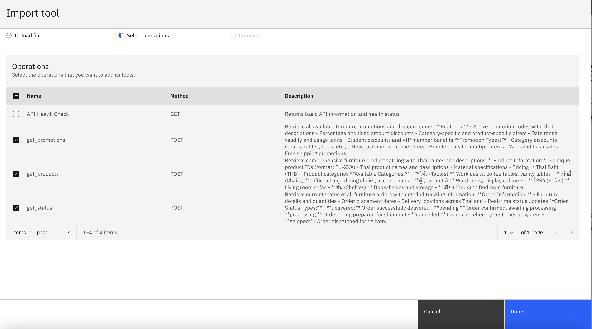
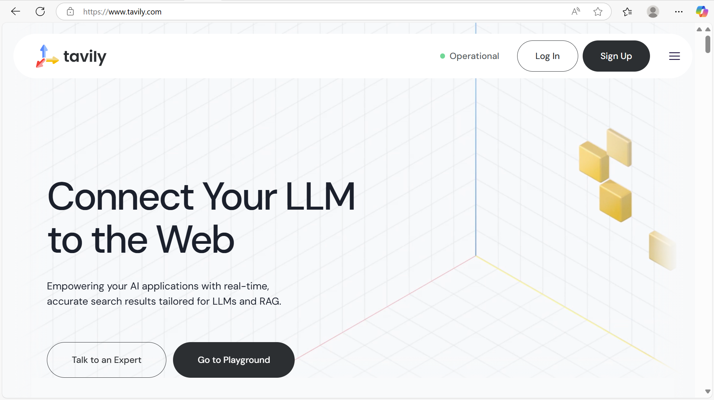

## Part 1: Create agent

Create an agent called `information_agent`

use the following description for the agent:

```
This agent handles internal tasks such as product information lookup, promotion or voucher lookup, getting the status of the product, and websearch to research support. It is not client-facing but works behind the scenes to provide accurate internal knowledge for decision-making and client support.
```

Please upload the `information_openapi.json`



select `get_products`, `get_status`, `get_promotions` from the list


- **Test get_products**: 
ร้านนี้มีเก้าอี้สีแดงขายบ้างไหม
- **Test get_promotions**: 
มี voucher อะไรที่ใช้ลดราคาสินค้านี้ได้บ้าง
- **Test get_status**: 
ที่เคยสั่งเก้าอี้สีแดงไว้ ตอนนนี้อยู่ที่ไหนแล้ว


## Part 2: adding MCP Tools


Visit the [Tavily website](https://www.tavily.com/)
a. Sign up or log in to your account



b. Copy your API key and add it to your `.env` file

