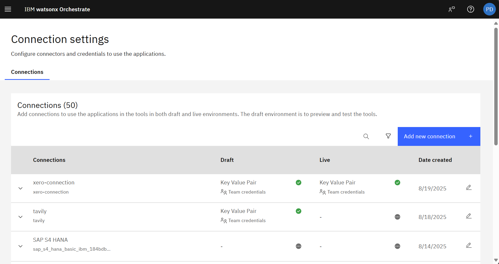
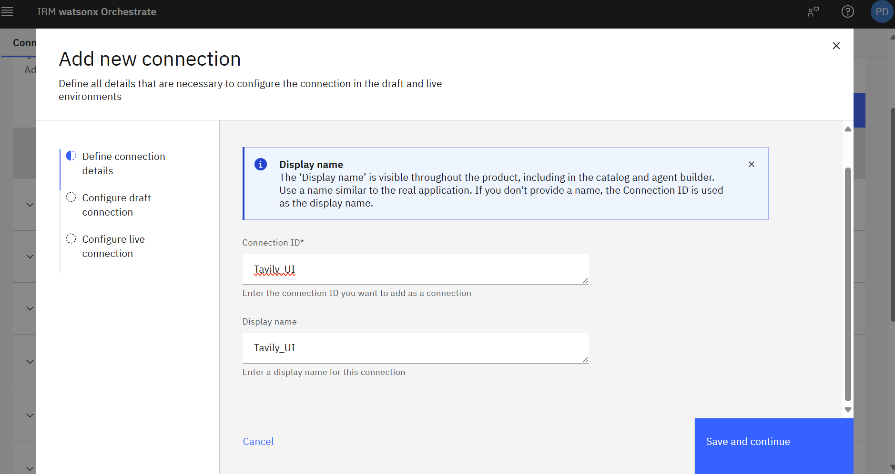
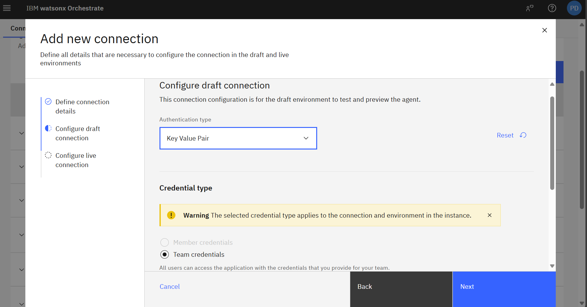
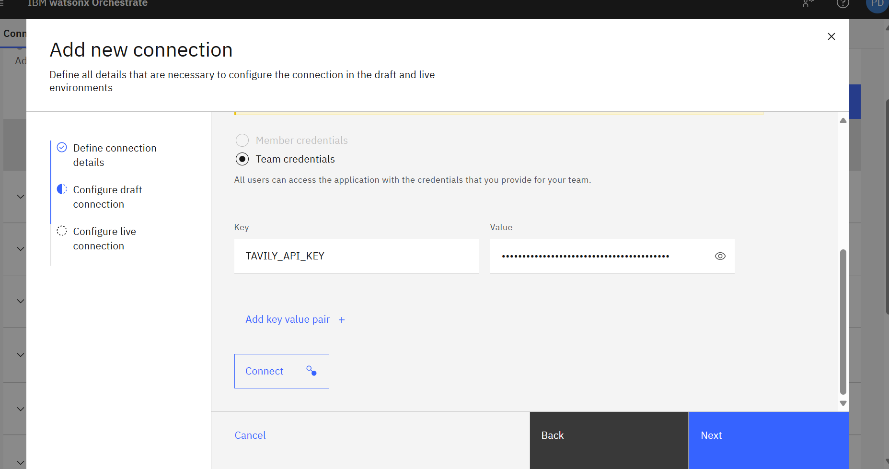
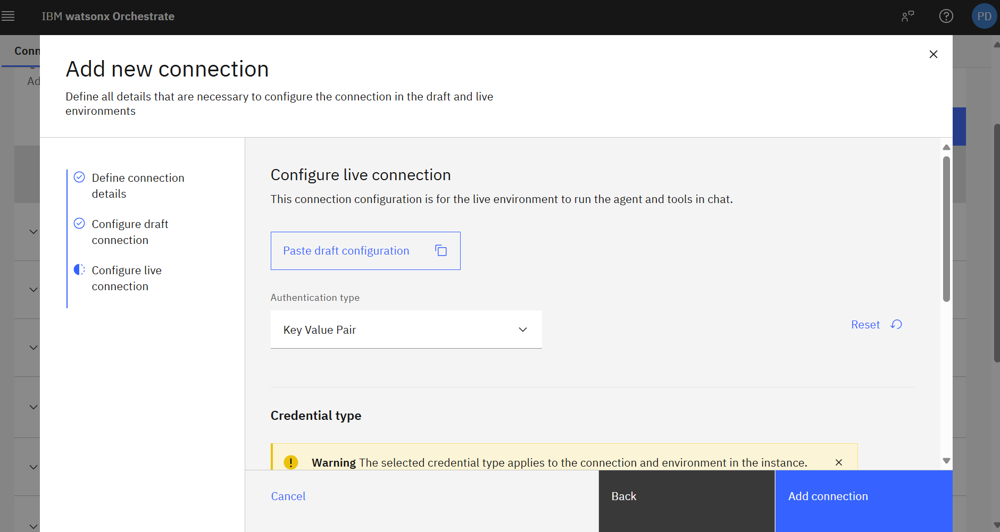
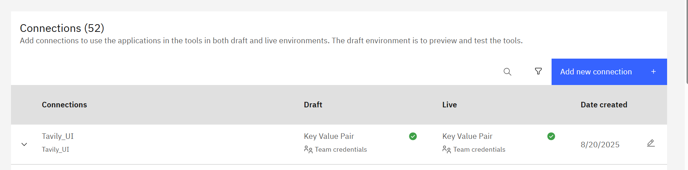
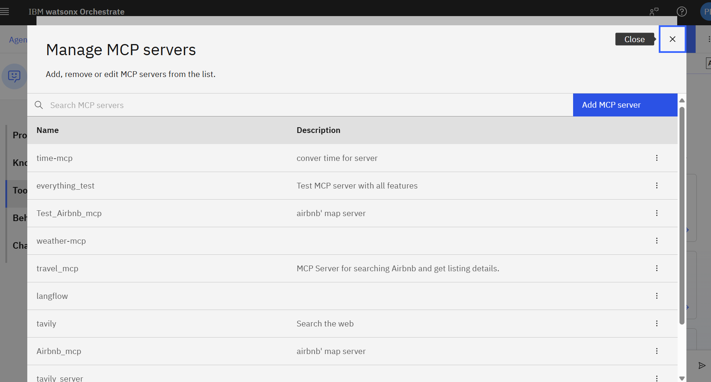
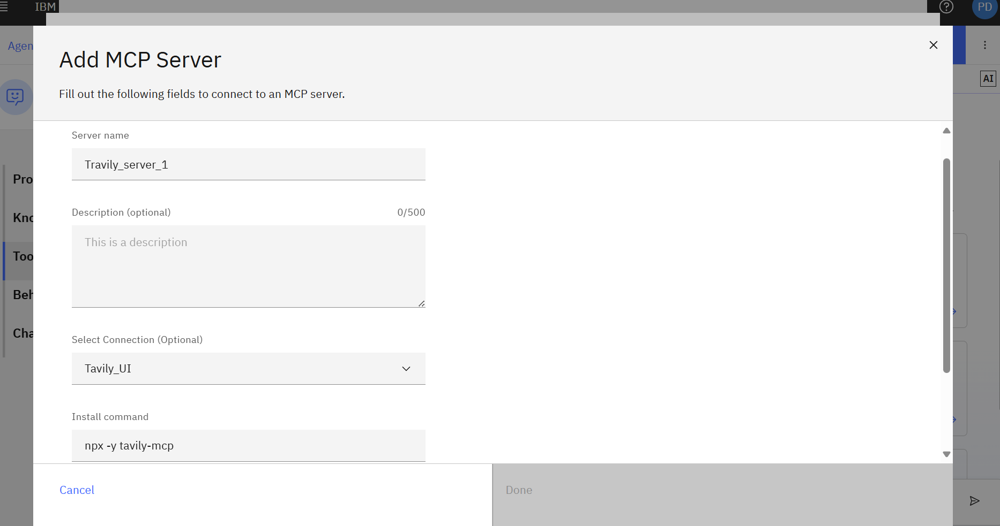
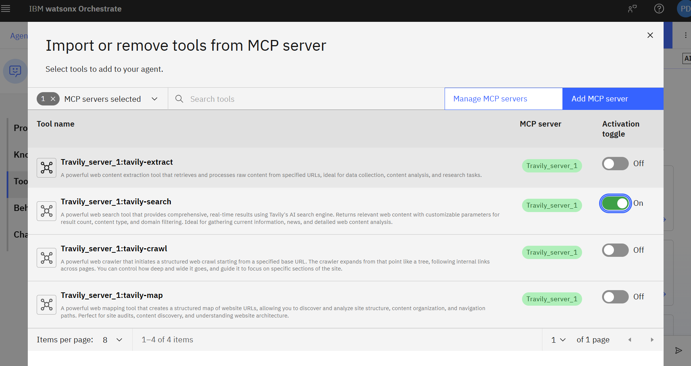
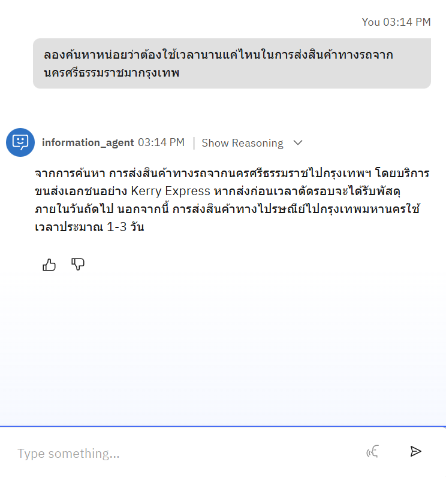

## Part 1: Create the Agent

1. **Create an agent** called `information_agent`.
2. **Agent Description:**
	 > This agent handles internal tasks such as product information lookup, promotion or voucher lookup, getting the status of the product, and websearch to research support. It is not client-facing but works behind the scenes to provide accurate internal knowledge for decision-making and client support.
3. **Upload** the `information_openapi.json` file.
4. **Select the following endpoints:**
	 - `get_products`
	 - `get_status`
	 - `get_promotions`

	 

5. **Test the endpoints:**
	 - **get_products:**
		 > ร้านนี้มีเก้าอี้สีแดงขายบ้างไหม
	 - **get_promotions:**
		 > มี voucher อะไรที่ใช้ลดราคาสินค้านี้ได้บ้าง
	 - **get_status:**
		 > ที่เคยสั่งเก้าอี้สีแดงไว้ ตอนนนี้อยู่ที่ไหนแล้ว

---

## Part 2: Add MCP Tools (Tavily)

1. Visit the [Tavily website](https://www.tavily.com/) and **sign up or log in**.
   
	 

2. **Copy your API key** (you will use this in the next steps).
   
	 

3. Go to **Manage > Connections** and add a new connection:
	 - 
	 - Enter a **connection ID** and **display name**.
		 
	 - For draft connection:
		 - Set authentication type to **Key Value Pair**
		 - Choose credential type **"team"**
		 
		 - Add Key `TAVILY_API_KEY` and paste your API key from step 2 as the value, then click **Connect**.
		 
	 - Repeat the above for the **live connection**, then click **Add Connection**.
		 
		 

4. Go back to your **agent toolkits** and **import external tool** from MCP server:
	 - 
	 - Click **Add MCP Server** and enter:
		 - Server name
		 - Previously added connection (from step 3)
		 - Install command: `npx -y tavily-mcp`
		 
	 - Toggle the **Tavily Search Tool**
		 

5. **Test the agent's web search tool** with the prompt:
	 > ลองค้นหาหน่อยว่าต้องใช้เวลานานแค่ไหนในการส่งสินค้าทางรถจากนครศรีธรรมราชมากรุงเทพ
	 
