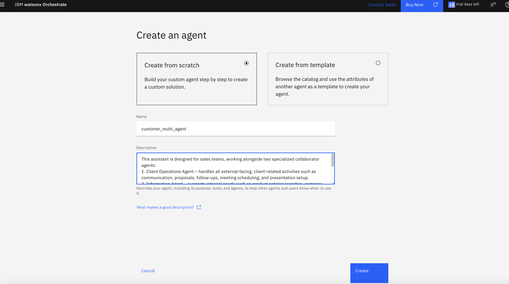

### Instructions
1. Please create a new agent. called `sales_multi_agent` and paste the description from `description.txt`

2. Switch the model to gemini-flash-2.5 and add the `client-operation-agent` from LAB1 and `information-agent` from LAB2

3. Now add the instructions from `instructions.txt` to the model's instruction in the behaviour section

### Final tests
#### PART I: ต้องการซื้อเก้าอี้ใหม่จากร้าน 
1. ร้านนี้มีเก้าอี้สีแดงขายบ้างไหม
2. มี voucher อะไรที่ใช้ลดราคาสินค้านี้ได้บ้าง
3. สั่งซื้อเก้าอี้แดงคาร์มินและใช้ voucher CHAIRLOVER30

#### PART II: สั่งออร์เดอร์ไปแล้วต้องการตามสถานะสินค้า 
4. ที่เคยสั่งเก้าอี้สีแดงไว้ ตอนนนี้อยู่ที่ไหนแล้ว
5. ลองค้นหาหน่อยว่าต้องใช้เวลานานแค่ไหนในการส่งสินค้าทางรถจากนครศรีธรรมราชมากรุงเทพ

#### PART III: ลูกค้าใช้เก้าอี้ไปซักพักแล้วพัง 
6.1 ช่วยร่างอีเมลให้หน่อย เก้าอีที่เคยส่งไปมันพัง เขียนเป็นทางการหาเจ้าหน้าที่
6.2 ส่งไปหาคุณ A ครับ อีเมล `your email` ด้วย subject: นัดหมาย เจ้าหน้าที่คุยเรื่องเก้าอี้พัง
เนื้อหา: อยากเจอเจ้าหน้าที่ วันที่ 11 ธันวาคม เวลา 10:00-11:00 นัดคุยเรื่อง การซ้อมเก้าอี้ ลงท้ายเป็นทางการ ชื่อ B
7. ช่วยนัดวันคุยใน google calendar วันที่ 11 ธันวาคม เวลา 10:00-11:00 คุยเรื่อง การซ้อมเก้าอี้ กับ `your email`